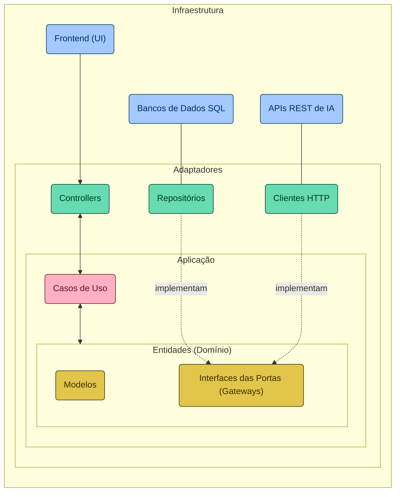

# Santander Dev Week 2024

## Sobre o Projeto

Neste repositório, você encontrará o código-fonte de uma RESTful API e seu Frontend (pasta `/docs`), desenvolvidos durante a Santander Dev Week 2024, fruto de uma colaboração entre a DIO e o Santander. Este projeto, construído com Java 21 e Spring Boot 3, é o resultado de quatro dias de lives, com um propósito singular: permitir que os usuários interajam de maneira imersiva e personalizada com os campeões do League of Legends (LoL). Para isso, utilizamos algumas das mais recentes Inteligências Artificiais (IAs) Generativas, possibilitando que nossa API "entenda" a personalidade única de cada campeão para criar interações que capturam sua essência, tornando cada conversa uma experiência única e envolvente.

### Agenda das Lives

- 25/03 às 19h | **Iniciando o seu Primeiro Projeto Java do Zero:** 
Aprendizado dos fundamentos da linguagem de programação Java e configurações de projetos Spring Boot. Foco em Programação Orientada a Objetos e sua relação com Bancos de Dados SQL através do Spring Data JDBC.

- 26/03 às 19h | **Criando uma API com os Campeões do League of Legends:** 
Criação de APIs REST, abordando design, desenvolvimento e documentação, com foco em campeões do League of Legends. Publicação da API no AWS Elastic Beanstalk.

- 27/03 às 19h | **Potencializando sua API com Inteligência Artificial (IA):** 
Incorporação de IA para otimizar a API, utilizando o Spring Cloud OpenFeign para integração com APIs de IA de grandes provedores, como OpenAI (GPT) e Google (Gemini).

- 28/03 às 19h | **Conversando com os Campeões do LoL com HTML, CSS e JavaScript:** 
Construção da interface do usuário, interatividade e integração com a API através de fundamentos de HTML, frameworks CSS e JavaScript.

## Como Participar dos Bootcamps Santander 2024

Ainda não se inscreveu? **Inscreva-se até 08/04/2024 nos [Bootcamps Santander 2024](https://bit.ly/48S4DCy)** para uma experiência educacional completa, explorando em detalhes os temas abordados durante a Santander Dev Week 2024, incluindo:

1. [Backend com Java e Spring Boot](https://web.dio.me/track/santander-2024-backend-com-java)
2. [Certificação AWS Cloud Practitioner (CLF-C02)](https://web.dio.me/track/santander-2024-preparatorio-certificacao-aws)
3. [Desenvolvimento de Jogos com Godot](https://web.dio.me/track/santander-2024-criando-jogos-com-godot) 
4. [Fundamentos de IA Para Devs](https://web.dio.me/track/santander-2024-fundamentos-de-ia-para-devs) 

### Links Úteis

- [Landing Page com a Agenda das Lives da Santander Dev Week 2024](https://pages.dio.me/santander-dev-week-2024)
- [Inscrições para os Bootcamps Santander 2024](https://bit.ly/48S4DCy)
- [Certifique-se na plataforma DIO](https://bit.ly/3Pc64Fe)

## Arquitetura do Projeto

### Diagrama Arquitetural
A seguir, apresentamos o diagrama arquitetural do projeto (escrito com [Mermaid](https://mermaid.js.org/)), destacando a separação das responsabilidades entre as camadas. Desde a interface de usuário até os mecanismos de interação com sistemas externos, passando por adaptadores, casos de uso e as entidades centrais do domínio, cada elemento é estrategicamente posicionado para reforçar a modularidade, a escalabilidade e a manutenibilidade do sistema. Esta estrutura facilita a compreensão de como os componentes colaboram para a realização dos objetivos do software, alinhando-se aos princípios da [Clean Architecture](https://blog.cleancoder.com/uncle-bob/2012/08/13/the-clean-architecture.html) (inclusive nas cores dos elementos).



### Estrutura de Diretórios

Refletindo a organização apresentada no diagrama arquitetural, a estrutura de diretórios do projeto sugere uma Clean Architecture simplificada, visando a uma clara separação das responsabilidades e promovendo a autonomia das camadas em um projeto Spring Boot. Esta abordagem estrutural não só facilita a manutenção e a evolução do código, mas também sustenta a integração e a colaboração eficaz entre as diferentes partes da aplicação. A seguir, detalhamos a disposição dos diretórios que compõem a aplicação, cada um desempenhando um papel específico dentro do ecossistema de software:

-   `adapters/`: Inclui os adaptadores que facilitam a comunicação entre a aplicação e o mundo externo (único diretório que "conhece" o Spring).
    -   `in/`: Abriga os adaptadores de entrada, tais como controladores REST, que lidam com as requisições dos usuários.
    -   `out/`: Contém os adaptadores de saída, responsáveis da interação com bancos de dados e APIs externas, por exemplo.
-   `application/`: Hospeda os casos de uso da aplicação, encapsulando a lógica de negócios essencial.
-   `domain/`: Representa o coração da aplicação, englobando entidades, exceções e interfaces (portas) que articulam as regras de negócio fundamentais.
    -   `exception/`: Define as exceções personalizadas pertinentes ao domínio.
    -   `model/`: Modela as entidades do domínio, refletindo os conceitos centrais da aplicação.
    -   `ports/`: Estabelece as interfaces que delineiam os contratos para os adaptadores e serviços externos.
-   `Application.java`: A classe principal que orquestra a configuração e o execução da aplicação.

### Banco de Dados SQL em Memória

A utilização do banco de dados H2 neste projeto serve como uma fundação ágil e flexível para modelar nosso domínio de conhecimento — os campeões do League of Legends. Essa escolha permite uma rápida prototipação e um ambiente de desenvolvimento eficiente, essencial para armazenar e recuperar informações detalhadas sobre cada campeão. Dessa forma, garantimos que as IAs Generativas que integramos possam acessar um repositório rico e detalhado, permitindo-lhes capturar com precisão a essência e a personalidade única de cada campeão, enriquecendo assim a interatividade e a profundidade das interações realizadas.

```sql
CREATE TABLE IF NOT EXISTS champions (
    id INT AUTO_INCREMENT PRIMARY KEY,
    name VARCHAR(255) NOT NULL,
    role VARCHAR(255) NOT NULL,
    lore TEXT,
    image_url VARCHAR(255)
);

INSERT INTO champions (name, role, lore, image_url) VALUES
    ('Jinx', 'Atirador', 'Uma criminosa impulsiva e maníaca de Zaun, Jinx vive para disseminar o caos sem se preocupar com as consequências. Com um arsenal de armas mortais, ela detona as explosões mais altas e mais luminosas para deixar um rastro de destruição e pânico por onde passa. Jinx abomina o tédio e deixa alegremente sua marca caótica de pandemônio aonde quer que vá.', 'https://ddragon.leagueoflegends.com/cdn/img/champion/splash/Jinx_0.jpg'),
    ('Vi', 'Lutador', 'Antiga criminosa das ruas violentas de Zaun, Vi é uma mulher temível, impulsiva e explosiva que tem muito pouco respeito por autoridades. Após ter crescido completamente só, Vi desenvolveu instintos de sobrevivência extremamente certeiros e um senso de humor extremamente ácido. Agora trabalhando com os Vigias de Piltover para manter a paz, ela porta poderosas manoplas hextec capazes de esmagar paredes e suspeitos com a mesma facilidade.', 'https://ddragon.leagueoflegends.com/cdn/img/champion/splash/Vi_0.jpg'),
    ('Ekko', 'Assassino', 'Um prodígio das ruas violentas de Zaun, Ekko manipula o tempo para reverter qualquer situação a seu favor. Usando sua própria invenção, o Revo-Z, ele explora as possíveis bifurcações da realidade para criar o momento perfeito. Embora valorize muito sua liberdade, quando algo ameaça seus amigos, ele não mede esforços para defendê-los. Para meros observadores, Ekko parece conseguir o impossível sempre de primeira.', 'https://ddragon.leagueoflegends.com/cdn/img/champion/splash/Ekko_0.jpg'),
    ('Caitlyn', 'Atirador', 'Conhecida como sua melhor pacificadora, Caitlyn também é a melhor escolha de Piltover para livrar a cidade de seus elementos criminosos elusivos. É comum que ela faça dupla com Vi, agindo como um contraponto de calmaria para a natureza impetuosa de sua parceira. Mesmo carregando um rifle hextec único, a arma mais poderosa de Caitlyn é seu intelecto superior, que permite que ela prepare elaboradas armadilhas para qualquer fora da lei tolo o suficiente para operar na Cidade do Progresso.', 'https://ddragon.leagueoflegends.com/cdn/img/champion/splash/Caitlyn_0.jpg'),
    ('Jayce', 'Lutador', 'Jayce é um brilhante inventor que dedicou sua vida a defender Piltover e sua implacável busca pelo progresso. Com seu martelo hextech transformador em mãos, Jayce usa sua força, coragem e considerável inteligência para proteger sua cidade natal. Embora seja aclamado pela cidade como herói, ele não gosta muito da atenção que o heroísmo traz. Mesmo assim, o coração de Jayce está no lugar certo e até aqueles que invejam suas habilidades naturais são gratos à forma como ele protege a Cidade do Progresso.', 'https://ddragon.leagueoflegends.com/cdn/img/champion/splash/Jayce_0.jpg'),
    ('Viktor', 'Mago', 'Viktor, o arauto de uma nova era de tecnologia, devotou sua vida ao avanço da humanidade. Um idealista que busca elevar o povo de Zaun a um novo nível de compreensão, ele acredita que somente ao aceitar a evolução gloriosa da tecnologia será possível que a humanidade alcance seu verdadeiro potencial. Com um corpo melhorado por aço e ciência, Viktor é zeloso na sua busca por este brilhante futuro.', 'https://ddragon.leagueoflegends.com/cdn/img/champion/splash/Viktor_0.jpg'),
    ('Heimerdinger', 'Mago', 'Um cientista brilhante, mesmo que excêntrico, o Professor Cecil B. Heimerdinger é um dos inventores mais inovadores e estimados que Piltover já conheceu. Incansável em seu trabalho ao ponto da obsessão neurótica, ele busca responder as questões mais impenetráveis do universo. Apesar de suas teorias frequentemente parecerem obscuras e esotéricas, Heimerdinger produziu algumas das máquinas mais miraculosas, sem mencionar letais, de Piltover e ajusta constantemente suas invenções para torná-las ainda mais eficientes.', 'https://ddragon.leagueoflegends.com/cdn/img/champion/splash/Heimerdinger_0.jpg'),
    ('Singed', 'Tanque', 'Singed é um alquimista zaunita de intelecto inigualável, que devotou sua vida a ultrapassar os limites do conhecimento; e nenhum preço, nem sua própria sanidade, é alto demais. Existe cura para sua loucura? Suas misturas raramente falham, mas, para muitos, Singed perdeu qualquer noção da humanidade, deixando uma trilha tóxica de miséria e terror no seu caminho.', 'https://ddragon.leagueoflegends.com/cdn/img/champion/splash/Singed_0.jpg'),
    ('Ryze', 'Mago', 'Considerado pela grande maioria como o mago mais habilidoso de Runeterra, Ryze é um arquimago ancião e amargo que carrega um enorme peso. Dotado de um enorme poder arcano e de uma notável estrutura física, ele busca incansavelmente pelas Runas Globais, que são fragmentos de magia pura que um dia criaram o mundo a partir do nada. Ele deve recuperar esses artefatos antes que eles caiam em mãos erradas, pois Ryze conhece bem os horrores que eles podem infligir em Runeterra.', 'https://ddragon.leagueoflegends.com/cdn/img/champion/splash/Ryze_0.jpg'),
    ('Master Yi', 'Assassino', 'Master Yi treinou seu corpo e afiou sua mente para que pensamento e ação se tornassem quase um só. Embora ele prefira recorrer à violência como último recurso, a leveza e a velocidade de sua espada garantem uma resolução sempre veloz. Como um dos últimos praticantes da arte ioniana do Wuju, Yi dedicou sua vida a preservar o legado de seu povo, avaliando potenciais discípulos com as Sete Lentes da Perspicácia para identificar qual deles era o mais digno.', 'https://ddragon.leagueoflegends.com/cdn/img/champion/splash/MasterYi_0.jpg'),
    ('Garen', 'Lutador', 'Um guerreiro nobre e orgulhoso, Garen faz parte da Vanguarda Destemida. Popular entre seus companheiros e respeitado o suficiente por seus inimigos, sua reputação é nada mais do que o esperado de um herdeiro da prestigiosa família Stemmaguarda, encarregada de defender Demacia e seus ideais. Vestido com uma armadura resistente à magia e empunhando uma poderosa espada, Garen está sempre pronto para confrontar magos e feiticeiros no campo de batalha, em um verdadeiro furacão de aço virtuoso.', 'https://ddragon.leagueoflegends.com/cdn/img/champion/splash/Garen_0.jpg'),
    ('Teemo', 'Atirador', 'Indiferente até aos obstáculos mais perigosos e ameaçadores, Teemo vasculha o mundo com infinito entusiasmo e animação. Um yordle com uma inabalável moral que se orgulha de seguir o Código dos Escoteiros de Bandópolis, às vezes com tanta dedicação que não se toca das possíveis consequências de suas ações. Embora alguns duvidem da existência dos escoteiros, uma coisa é certa: nunca se deve duvidar das convicções de Teemo.', 'https://ddragon.leagueoflegends.com/cdn/img/champion/splash/Teemo_0.jpg');
```

## Contribuições

Contribuições são sempre bem-vindas! Veja como você pode contribuir:

1. Faça um fork do projeto.
2. Crie uma nova branch com suas modificações: `git checkout -b minha-nova-feature`.
3. Faça commit das suas alterações: `git commit -am 'Adicionando uma nova feature'`.
4. Push para a branch: `git push origin minha-nova-feature`.
5. Envie um pull request.
